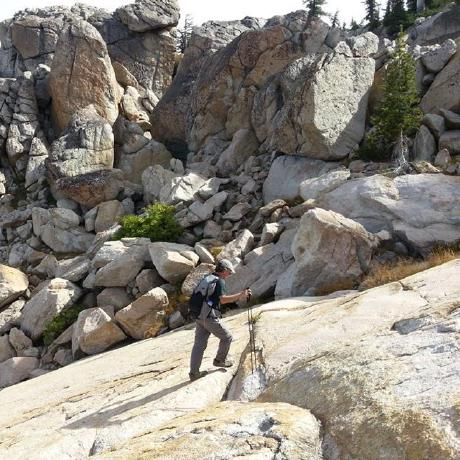

Current members of the COSI team are listed in no particular order below.

|  | Name | Organization | GitHub | Twitter |
| --- | --- | --- | --- | --- |
|| Sidhartha Mani | <a href="https://min.io/">MinIO, Inc.</a> | <a href="https://github.com/wlan0"> wlan0 </a> | <a href="https://twitter.com/utter_babbage"> utter_babbage </a> |
|| Jeff Vance | <a href="https://redhat.com">Red Hat, Inc.</a> | <a href="https://github.com/jeffvance"> jeffvance </a> | <a href="https://twitter.com/jeffvance"> jeffvance </a> |
|| Srini Brahmaroutu | <a href="https://ibm.com/">IBM</a> | <a href="https://github.com/brahmaroutu"> brahmaroutu </a> | <a href="https://twitter.com/brahmaroutu"> brahmaroutu </a> |
|| Krish Chowdhary | <a href="https://redhat.com">Red Hat, Inc.</a> | <a href="https://github.com/krishchow"> krishchow </a> | <a href="https://twitter.com/krishchow_"> krishchow_ </a> |
|| Rob Rati | <a href="https://redhat.com">Red Hat, Inc.</a> | <a href="https://github.com/rrati"> rrati </a> | - |
|| Tejas Parikh | - | <a href="https://github.com/tparikh"> tparikh </a> | <a href="https://twitter.com/tejasparikh"> tejasparikh </a> |
